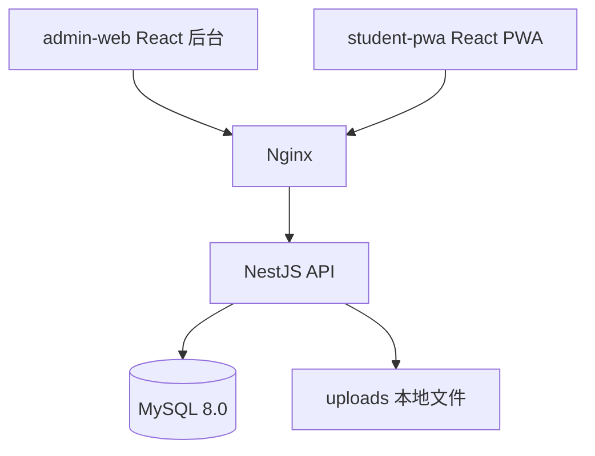

# Kids Quiz 系统架构方案

## 总体架构



## 技术栈

| 层 | 技术 |
|---|---|
| 后台管理 | React + Vite + TypeScript + Ant Design + TanStack Query |
| 学生端 | React + Vite + TypeScript + Tailwind + PWA + Framer Motion |
| 后端 | NestJS + Prisma + MySQL |
| 认证 | JWT + Refresh Token |
| 题目渲染 | 自研 question-render，支持空、连线、排序、公式 |
| 公式 | KaTeX |
| 图表 | ECharts 或 Recharts |
| 部署 | Nginx + Node.js/PM2，后期 Docker Compose |

## 路由规划

```text
/admin/*     后台管理端
/app/*       学生 PWA
/api/admin/* 管理员 API
/api/student/* 学生端 API
/api/public/* 公开配置 API
```

## 权限原则

- 管理员 API 必须 JWT。
- 学生端不使用账号密码，但需要 student session / device session / 可选 PIN。
- 所有业务数据必须有 ownerId，避免跨家庭/跨班级访问。
- 公开接口只返回静态配置，不返回题库和学生数据。
